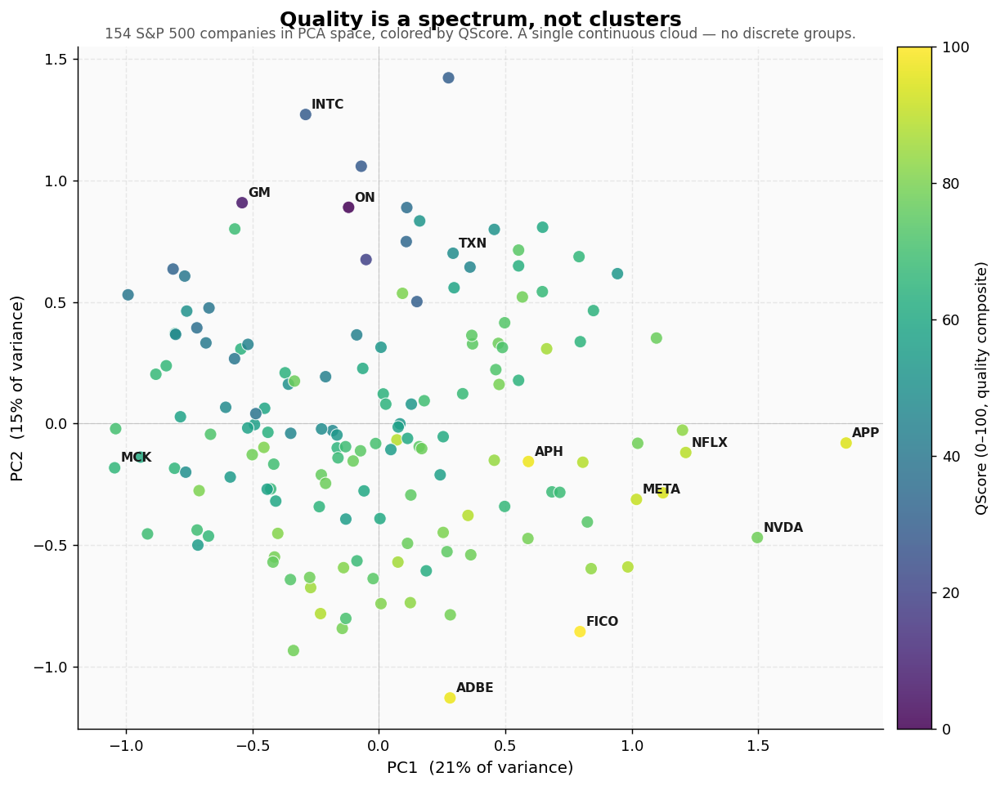
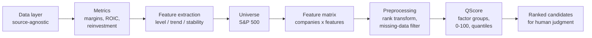

# Quality Pattern Engine

**A capital-efficiency-tilted factor model that screens equities for sustainable quality — built as a human-plus-machine analysis engine, not a black box.**

The machine filters the financial footprint of quality objectively; the human supplies the technical and domain judgment a balance sheet cannot. The machine screens the past; the human judges the future.



*154 S&P 500 companies projected into PCA space, colored by their composite QScore. The data forms a single continuous cloud — there are no discrete "quality clusters." Quality is a spectrum, and the score recovers it: high-scoring names (FICO, Adobe, Amphenol) sit at one end, capital-intensive cyclicals (GM, ON, Intel) at the other.*

---

## What it does

Given a universe of companies, the engine:

1. Pulls fundamentals through a source-agnostic data layer (yfinance today; designed to swap to a richer provider without a rewrite).
2. Computes seven quality metrics from raw statements — margins, revenue growth, ROIC, and reinvestment — including derived measures (ROIC via NOPAT / invested capital, reinvestment via Damodaran's net-capex method) that are not available off-the-shelf.
3. Summarizes each metric's time series into level, trend, and stability features.
4. Ranks every company on every feature, aggregates into a single **QScore (0-100)**, and sorts the universe from premium quality to value trap.

The output is a ranked list of candidates for human review — not an automated buy signal.

## How it works



Each stage is a separate, tested module. The design separates concerns deliberately: the data layer is swappable, the metrics are derived transparently, and a strict feature/meta split keeps audit information (R-squared, sample size) out of the scoring path to prevent data leakage.

## Methodology highlight

The original design called for unsupervised clustering. The data refused: K-means produced either meaningless splits (a single structural outlier isolated from an undifferentiated mass) or low-quality boundaries, and a PCA projection showed the first two components explaining only 36% of variance — a continuous cloud, not discrete groups.

So the architecture pivoted from clustering to **continuous quantile scoring**, and outliers were tamed at the root with a cross-sectional rank transform (preserving order without letting a single extreme value dominate). This was a hypothesis tested against data, refuted, and updated — not a model forced onto unwilling data.

The full reasoning — philosophy, the clustering-to-spectrum pivot, results, limitations, and roadmap — is in **[STRATEGY.md](./STRATEGY.md)**.

## Quick start

**Linux / macOS:**
```bash
python3 -m venv venv
source venv/bin/activate
pip install yfinance pandas numpy scipy scikit-learn pytest lxml requests

python3 run.py --companies 200 --delay 0.3
```

**Windows (PowerShell):**
```powershell
python -m venv venv
venv\Scripts\Activate.ps1
pip install yfinance pandas numpy scipy scikit-learn pytest lxml requests

python run.py --companies 200 --delay 0.3
```

On first run the engine fetches fundamentals (this takes a few minutes and is cached afterward), then ranks the companies by QScore. Options:

- `--companies N` — number of companies to analyze (random S&P 500 sample, max ~503; default 200)
- `--delay D` — seconds between fetches, rate-limit protection for the free yfinance source (default 0.3)
- `--seed S` — random seed for reproducible sampling (default 42)

Run `python3 run.py --help` for details.

Tests: run `python -m pytest tests/ -v` (or `python3` on Linux/macOS) — 22 risk-based tests.

## Example output

The example below uses a 200-company sample (154 remain after filtering out financials, REITs, and incomplete data). The architecture scales to the full ~503-company index — the only constraint is the throughput of the free data source, not the engine. Phase 2's move to a richer data provider removes that limit.

Top of the ranking (equal-weight baseline):

| Rank | Ticker | QScore | Bucket |
|------|--------|--------|--------|
| 1 | FICO | 100.0 | Q1 |
| 2 | APH | 97.5 | Q1 |
| 3 | ADBE | 97.0 | Q1 |
| 4 | APP | 94.8 | Q1 |
| 5 | PTC | 94.0 | Q1 |
| 6 | META | 91.3 | Q1 |
| 7 | NFLX | 89.2 | Q1 |

Recurring-revenue software, ratings, and exchange businesses dominate the top — textbook capital-light compounders. Capital-intensive cyclicals (autos, refiners, semis-at-trough) fall to the bottom.

## What this is — and isn't

This is an honest **V1: smart beta, not alpha.** It rewards the *known* definition of quality, so it recovers *known* quality names. Specifically:

- **Not sector-neutral.** The top skews toward software/financial-data because those sectors are structurally capital-light. The model currently expresses a "long-quality-sectors" tilt rather than a pure within-sector quality signal.
- **Not yet validated.** A high QScore asserts a quality *profile* today, not proven *forward returns*. An out-of-sample information-coefficient test is the next validation step.
- **The capital-light tilt is a thesis choice.** Treating low reinvestment as good rewards Apple/Visa-type businesses and ranks down reinvestment-heavy growth-quality (this is why NVIDIA sits in Q2, not Q1). A compound-growth thesis would invert that signal.

Naming these boundaries is part of the work. They define the road to V2.

## Phase 2 — where this goes

The current engine is the skeleton. The next phase changes the signal design on top of it in two directions:

- **From levels to acceleration.** Today's score is dominated by absolute levels, so it confirms companies that are *already* obviously high quality. The more valuable signal is the *second derivative* — catching quality while it is still forming, by weighting the inflection in margins and returns rather than the plateau.
- **From a generic universe to a proprietary one.** A quality screen on the S&P 500 is a crowded trade. The structural edge lies where large funds cannot go for liquidity reasons — the under-covered micro/small-cap universe of deep-technical niches (space, defence, edge AI), where genuine technical-moat judgment, not balance-sheet ratios alone, separates signal from noise.

The combined direction — an early-acceleration signal applied to an under-covered, domain-specific universe — is the working thesis for Phase 2. This V1 is the financial-analysis foundation of a broader engineer-to-investor thesis at the intersection of deep-tech and capital allocation.

## Project structure

```
src/quality_engine/
  data/          source-agnostic data layer (DataProvider ABC, YFinanceProvider, universe)
  metrics/       metric calculation + feature extraction
  clustering/    K-means (retained from the clustering experiment; see STRATEGY.md)
  preprocessing.py   rank transform, missing-data filter
  scoring.py     QScore: factor groups, direction correction, quantile buckets
  pipeline.py    orchestration: universe -> feature matrix
run.py           end-to-end entry point
tests/           22 risk-based tests
STRATEGY.md      investment strategy memo (full methodology)
```

---

*This is a research and learning project, not investment advice.*
